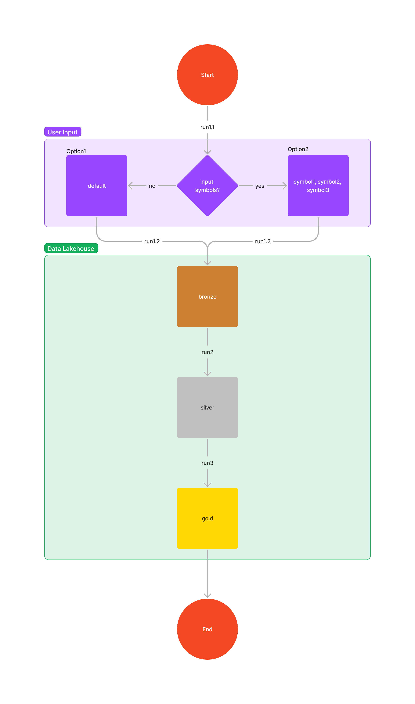

# Binance Trade Data Engineering
This project is a data engineering mini project that practices the basics of a data lakehouse by ingesting data from a source, storing and processing data in a data lakehouse zone including to bronze, silver, and gold.

## Table of Contents

- [Setup](#setup)
- [Run](#run)
- [How It Works](#how-it-works)
- [Limitations](#limitations)

## Setup

To setup this project, follow these steps:

1. Clone the repository:
```
git clone https://github.com/tharit-s/binance-trade-data-engineering.git
```

2. Go to the project root path:
```
cd binance-trade-data-engineering
```

3. Create a virtual environment:
```
python3 -m venv env
```

4. Activate the virtual environment:
```
source env/bin/activate
```

5. Install the dependencies:
```
pip install -r requirements.txt
```

## Run
End-2-end Diagram 

To run this project, follow these steps:

1. Data ingestion trade data from binance to the brzone folder
```
python src/zones/bronze/main.py
```
- After running the `main.py` script in the `bronze` zone, you will be prompted to select an option:
    - Option1: **Enter** to skip and use the default
    - Option2: **Input** your own symbols separated by commas for a sample list: `AAVEUSDT,STXUSDT,ARBUSDT` and then **Enter** to continue

2. Data transform trade data from the bronze fodler to the silver folder
```
python src/zones/silver/main.py
```

3. Data transform trade data from the silver fodler to the gold folder
```
python src/zones/gold/main.py
```

## How It Works
This project works by ingesting data from Binance, storing and processing the data in a data lakehouse.
### Data Architecture
- High Level Design

- Low Level Design


### Data Lakehouse
The project follows these steps to ingest, store, and process the data:
1. Bronze
- Request an input from the user.
- Call the RESTful API to Binance to return the trade data.
- Store the data in JSON format in the `datalakehouse/bronze` zone.
2. Silver
- Calculate the data for minutely intervals, including 1, 5, 15, 30, and 60 minutes.
- Add columns to specify the coin and raw filename.
- Store the data in CSV format in the `datalakehouse/silver` zone.
3. Gold
- Calculate the data for moving average (MA) periods, including 50, 100, and 200.
- Calculate the data for the position by comparing two MA metrics to SELL or BUY.
- Store the data in CSV format in the `datalakehouse/gold` zone.

### Data Organization
- Overview
```
binance-trade-data-engineering
├── src
├── datalakehouse
├── requirements.txt
├── images
├── READEME.md
└── learning_log.md
```
- Source Code
```
src
├── main
│   ├── __init__.py
│   └── main.py
└── zones
    ├── bronze
    │   ├── __init__.py
    │   └── bronze_module.py
    │   └── main.py
    ├── silver
    │   ├── __init__.py
    │   └── silver_module.py
    │   └── main.py
    └── gold
        ├── __init__.py
        └── gold_module.py
        └── main.py
```
- Data
```
datalakehouse
├── bronze
│   ├── batch
│   │   ├── coin1.json
│   │   ├── coin2.json
│   └── streaming
├── silver
│   ├── batch
│   │   ├── coin1_minutely_1.csv
│   │   ├── coin1_minutely_5.csv
│   │   ├── coin1_minutely_15.csv
│   │   ├── coin1_minutely_30.csv
│   │   ├── coin1_minutely_60.csv
│   │   └── coin2_minutely_1.csv
│   │   └── coin2_minutely_5.csv
│   │   └── coin2_minutely_15.csv
│   │   └── coin2_minutely_30.csv
│   │   └── coin2_minutely_60.csv
│   └── streaming
└── gold
    ├── batch
    │   ├── coin1_minutely_1.csv
    │   ├── coin1_minutely_5.csv
    │   ├── coin1_minutely_15.csv
    │   ├── coin1_minutely_30.csv
    │   ├── coin1_minutely_60.csv
    │   └── coin2_minutely_1.csv
    │   └── coin2_minutely_5.csv
    │   └── coin2_minutely_15.csv
    │   └── coin2_minutely_30.csv
    │   └── coin2_minutely_60.csv
    └── streaming
```
- Setup
    - **requirements.txt**: The file lists the Python packages that are required to run this project.

- Documents
    - **images**: This directory contains any images that are used in the project.
    - **README.md**: This file is the README file for the project. It provides an overview of the project and instructions on how to use it.
    - **learning_log.md**: This file is a learning log for the project. It documents the steps that were taken to learn and implement the project.

### Data Schema
1. Bronze
- **id**: Unique identifier for the data entry
  - Example: 32492152

- **price**: Price of the item
  - Example: 1.00580000

- **qty**: Quantity of the item
  - Example: 400.00000000

- **quoteQty**: Quote quantity of the item
  - Example: 402.32000000

- **time**: Timestamp of the data entry
  - Example: 1692846186370

- **isBuyerMaker**: Indicates if the buyer is the maker of the trade
  - Example: false

- **isBestMatch**: Indicates if the trade is the best match
  - Example: true

2. Silver
- **time**: Timestamp of the data entry
  - Example: 2023-08-24 03:00:00

- **open**: Opening price at the given time
  - Example: 1.0058

- **high**: Highest price within the time interval
  - Example: 1.0061

- **low**: Lowest price within the time interval
  - Example: 1.0056

- **close**: Closing price at the given time
  - Example: 1.0057

- **volume**: Volume of trading at the given time
  - Example: 734889.2000000001

- **filename**: Name of the JSON file containing related data
  - Example: ARBUSDT.json

- **coin**: Identifier for the specific coin or cryptocurrency
  - Example: ARBUSDT

- **minutelyInterval**: Interval of data collection (in minutes)
  - Example: 1, 5, 15, 30, 60

3. Gold
- **time**: Timestamp of the data entry
  - Example: 2023-08-24 03:03:00

- **open**: Opening price at the given time
  - Example: 1.0058

- **high**: Highest price within the time interval
  - Example: 1.0061

- **low**: Lowest price within the time interval
  - Example: 1.0056

- **close**: Closing price at the given time
  - Example: 1.0056

- **volume**: Volume of trading at the given time
  - Example: 677343.6000000001

- **filename**: Name of the JSON file containing related data
  - Example: ARBUSDT.json

- **coin**: Identifier for the specific coin or cryptocurrency
  - Example: ARBUSDT

- **minutelyInterval**: Interval of data collection (in minutes)
  - Example: 1, 5, 15, 30, 60

- **ma50**: 50-period Moving Average value
  - Example: 1.0056

- **ma100**: 100-period Moving Average value
  - Example: 1.0056

- **ma200**: 200-period Moving Average value
  - Example: 1.0056

- **position**: Our broker wants to buy and hold the asset by comarison between MA(low) and MA(high) when the MA(50) < MA(100), and sell to hold BUSD or USDT when MA(50) >= MA(100).
  - Example: SELL, BUY

## Limitations
This project has the following limitations:
- Streaming data is not implemented. The project currently only supports batch data.
- The system does not remove existing data before starting a new list of symbols. This means that if you start a new list of symbols that is different from the previous list, the data for the previous list may be replaced or incremented.
- The system does not implement a `main.py` file in the `src` directory. This means that the system cannot be run as a standalone program.