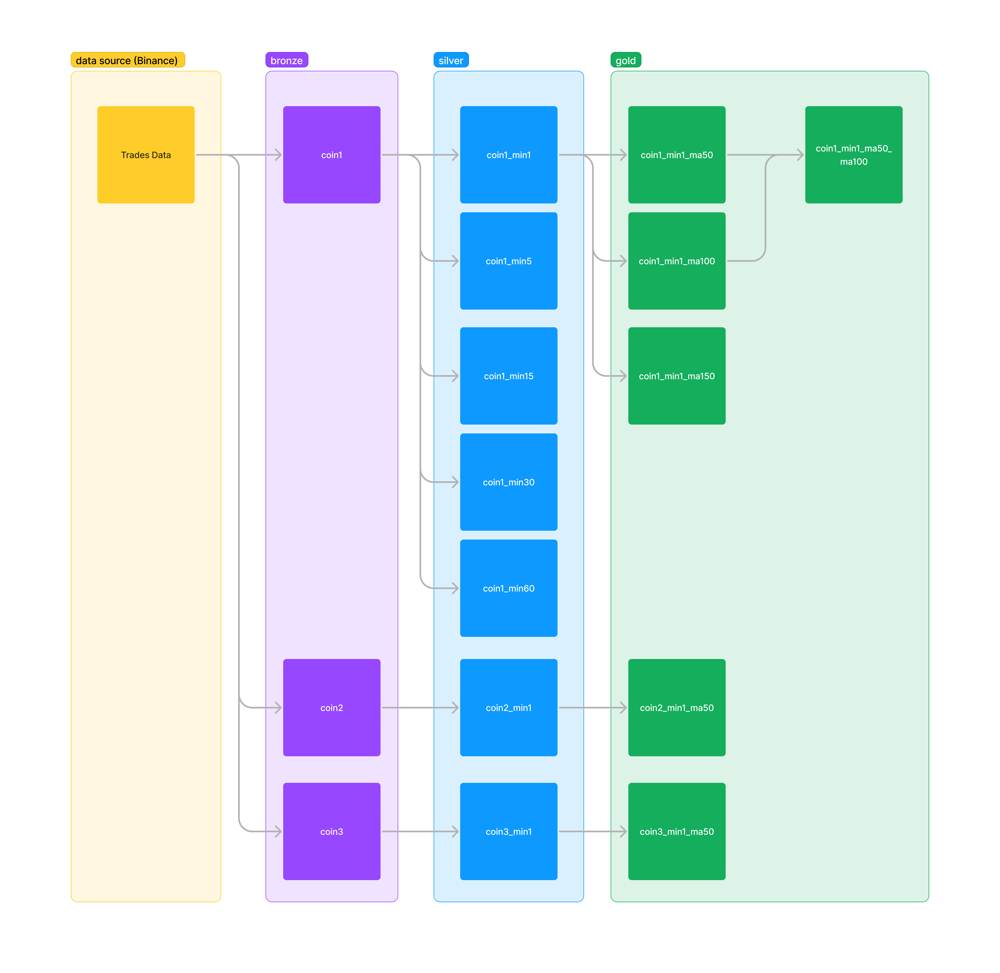

# bitazza-assignment-de
Bitazza assignment for data engineer

# action items
- self-learning websocket
- try to get data from the binance client
- try to use the `binance-connector-python` library
    - how to generate api key: https://stackoverflow.com/questions/67376632/how-to-create-binance-test-api-key
- try to use git on github
    - reset the password and use the api key instead
- design the data lakehouse zones from the assignment
    - bronze
        - get full load data via restful api
            - how to write a list of dictionaries into the local folder
            - which file types to store data
                - csv file for easily investigation
            - should partition data or replace after rerun the full load ingestion
            - design the folder structure in bronze zone
            - design when the input as a list of multiple coins
        - get streaming data via websocket
    - silver
        - transform data
            - cleansing data
                - convert timezone?
            - design data model
                - required columns
                    - open
                    - high
                    - low
                    - close
                    - volume
                - identity columns
                    - time?
                    - id?
                    - period of 1/5/15/30/60 minutely (by UTC time)?
            - how to calculate the data 1/5/15/30/60 minutely (by UTC time)
            - design folder structure in silver zone
    - gold
        - analyze data
            - design folder structure in gold zone
            - how to calculate MA({day_period}) from the closed price
            - create a new column for storing the status to buy or sell with the MA conditions
- naming convention
- design a diagram
    -  
- design a architect
- review the virtual environment
- write a document in README.md
- notify an email for the intruction

# Full load
- Get 2 records of `AAVEUSDT` from Binance RESTful API
[
    {'id': 104388712, 'price': '56.21000000', 'qty': '0.24300000', 'quoteQty': '13.65903000', 'time': 1692433675009, 'isBuyerMaker': False, 'isBestMatch': True
    },
    {'id': 104388713, 'price': '56.22000000', 'qty': '0.30100000', 'quoteQty': '16.92222000', 'time': 1692433707250, 'isBuyerMaker': False, 'isBestMatch': True
    }
]
- `id`: The unique identifier for the trade.
- `price`: The price of the trade in USDT.
- `qty`: The quantity of BTC traded in the trade.
- `quoteQty`: The total USDT value of the trade.
- `time`: The timestamp of the trade in Unix epoch milliseconds.
- `isBuyerMaker`: Indicates whether the buyer was the maker of the trade (True) or the taker of the trade (False).
- `isBestMatch`: Indicates whether the trade was the best price available at the time (True) or not (False).