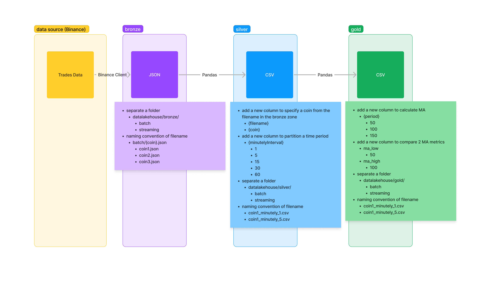

# Learning log
## Action items
- self-learning websocket -> done
- try to get data from the binance client -> done
- try to use the `binance-connector-python` library -> done
    - how to generate api key: https://stackoverflow.com/questions/67376632/how-to-create-binance-test-api-key
- try to use git on github -> done
    - reset the password and use the api key instead
- design the data lakehouse zones from the assignment -> done
    - bronze
        - get full load data via restful api
            - how to write a list of dictionaries into the local folder
            - which file types to store data
                - json file
            - should partition data or replace after rerun the full load ingestion
            - design the folder structure in bronze zone
            - design when the input as a list of multiple coins
              - Get 2 records of `AAVEUSDT` from Binance RESTful API
              ```
                [
                    {'id': 104388712, 'price': '56.21000000', 'qty': '0.24300000', 'quoteQty': '13.65903000', 'time': 1692433675009, 'isBuyerMaker': False, 'isBestMatch': True
                    },
                    {'id': 104388713, 'price': '56.22000000', 'qty': '0.30100000', 'quoteQty': '16.92222000', 'time': 1692433707250, 'isBuyerMaker': False, 'isBestMatch': True
                    }
                ]
              ```
        - get streaming data via websocket
    - silver
        - transform data
            - cleansing data
                - convert timezone?
            - design data model
                - required columns
                    - open
                    - high
                    - low
                    - close
                    - volume
                - identity columns
                    - time?
                    - id?
                    - period of 1/5/15/30/60 minutely (by UTC time)?
            - how to calculate the data 1/5/15/30/60 minutely (by UTC time)
            - design folder structure in silver zone
    - gold
        - analyze data
            - design folder structure in gold zone
            - how to calculate MA({day_period}) from the closed price
            - create a new column for storing the status to buy or sell with the MA conditions
- naming convention -> done
- design a diagram -> done
    -  High Level 
        - V1 
    -  Low Level 
        - V1 
        - V2 
- design a architect -> done
- design data medel in dbdiagram.io -> done
    -  
- review the virtual environment -> done
- apply the virtual environment into the project -> done
- add a note.md to store my short note while implementing -> done
- write a document in README.md -> done